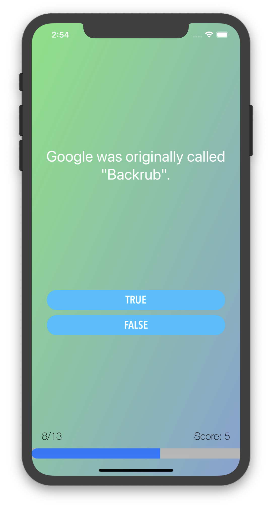
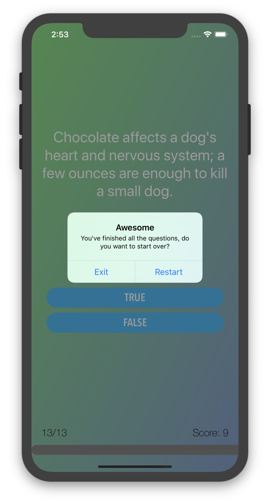

# An iOS Quiz App Named: *Quizzler*
This is *practise project* for iOS app development course.

__What I have learned here:__
1. Design pattern and how is it used in programming,
2. Using the Model-View-Controller or MVC pattern,
3. How to store data locally,
4. How to incorporate third party libraries and how to display Heads Up Displays (HUDs),
5. How to refactor code and stay organised,
6. Learned about class initialisation,
7. How to programmatically change UI elements such as Labels and Views,
8. Start thinking about data encapsulation and how to keep data safe from corruption.

___
__Screenshot:__
 
